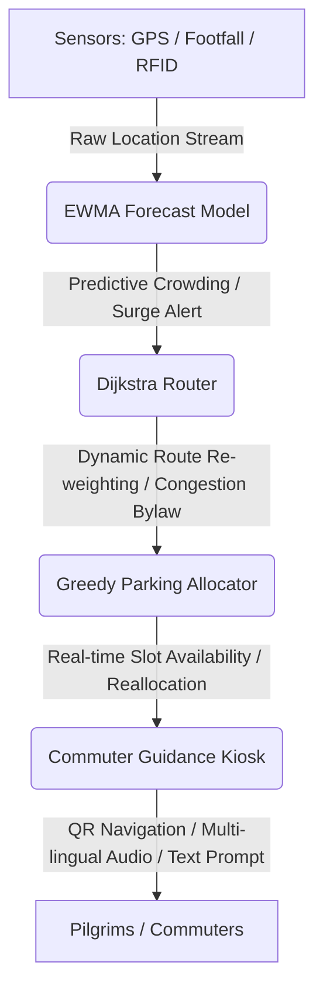

# 🕉️ KumbhFlow — Moving Millions, Missing Nothing


KumbhFlow is a real-time, AI-driven crowd control and transit orchestration system designed for **Mahakumbh 2025** (~660 million cumulative pilgrims). By converting raw sensor feeds into actionable routing and crowd mitigation procedures in-browser, KumbhFlow eliminates static mockups in favor of live, localized edge-intelligence.

---

## 📊 Core Architecture & Data Flow

KumbhFlow integrates multiple client-side models into a continuous execution loop. The following diagram shows how data flows from sensors through analytics to end-commuters:



---

## 🧠 Algorithmic Specifications & Formulas

### 1. EWMA / Holt-Winters Predictive Crowd Forecaster
- **Logic**: Forecasts future crowd levels at Ghats based on historical Snan curves, current registered pilgrim counts, approach road congestion, and weather conditions.
- **Surge Alert Threshold**: A **Surge Alert** is generated programmatically when projected crowd density exceeds **85% of Ghat capacity** (`Capacity × 0.85`).

### 2. Dijkstra Routing Engine & CO₂ Formula
- **Logic**: Route pathfinder dynamically updates link weights based on live congestion status (`Weight = BaseTime × (1 + Congestion)`). Generates 3 alternative routes: Primary (Optimized), Alternative A (Bypass), and Alternative B (Scenic).
- **CO₂ Calculation Formula**:
  $$\text{CO}_2 \text{ Saved (kg)} = \text{Vehicles} \times \text{Distance (km)} \times 0.12 \text{ kg/km}$$
  Where:
  - $\text{Vehicles} = \frac{\text{Pilgrims}}{4}$ (assuming average vehicle capacity of 4 pilgrims).
  - Average CO₂ emission rate is taken as $0.12\text{ kg/km}$ per vehicle.

### 3. Localization Settings
- Localized language state (`English` / `Hindi`) is saved to and retrieved from `localStorage` using the key `kumbh_lang`.

---

## ⏱️ Interactive Demo Center & Controls

KumbhFlow includes a fully automatic 60-second end-to-end cascading disaster/congestion simulation.
- **Keyboard Shortcut**: Press `D` to immediately start/stop the simulation from anywhere.
- **Reset Button**: Click the **"↻ Reset Scenario"** button in the Navbar to clear congestion overrides, reset the time back to `04:00`, and clear event logs.
- **Simulation Multiplier**: Adjust the speed multiplier (`simSpeedMultiplier` stored globally) to scale step durations relative to wall-clock time (default: 10s per step for 6 steps = 60s total).
- **Event Log**: Critical notifications and auto-mitigation events persist on screen for at least **4 seconds** and are permanently written to the **Event Log** panel on the Dashboard sidebar.

---

## 🛠️ Stack & Installation

- **Core Framework**: React 18, Vite 8, TypeScript-compatible JavaScript compilation.
- **Styling**: Vanilla Tailwind CSS v3.
- **Maps**: Leaflet.js (`react-leaflet`) centering on Prayagraj.
- **QR Codes**: Native client-side rendering via the local `qrcode` npm package (Navy-on-white: `#131A2B` on `#FFFFFF` for accessibility).

### Getting Started

1. Install dependencies:
   ```bash
   npm install
   ```
2. Run development server:
   ```bash
   npm run dev
   ```
3. Build for production:
   ```bash
   npm run build
   ```
