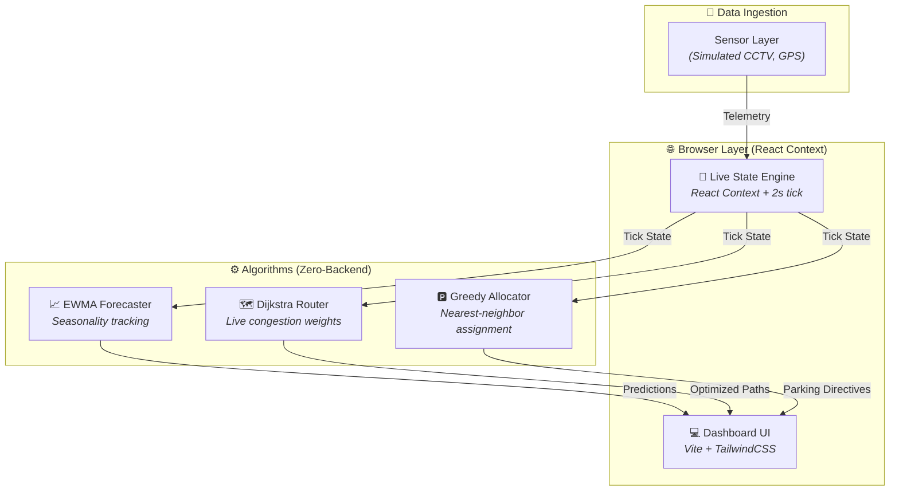
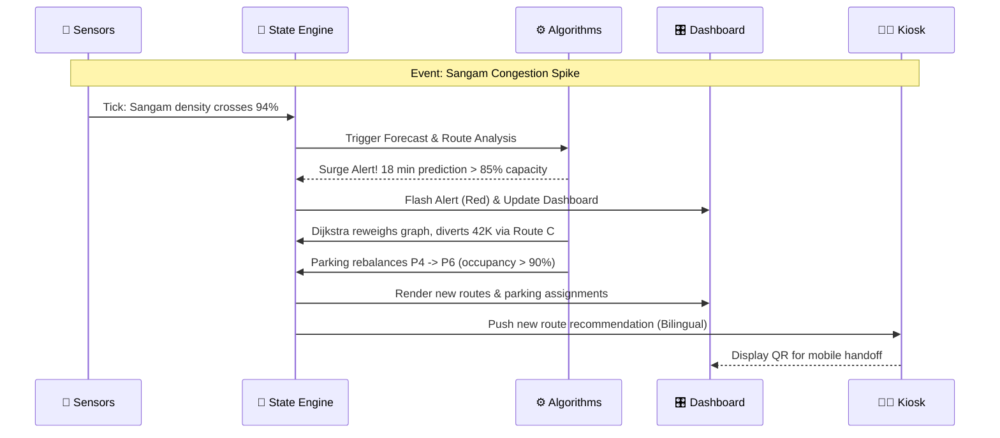

<div align="center">

# 🌊 KumbhFlow — AI-Powered Crowd Management Dashboard

### *Move Millions. Miss Nothing.* — Intelligent mobility orchestration for Mahakumbh 2025

[](https://react.dev/)
[](https://vitejs.dev/)
[](https://tailwindcss.com/)
[](https://leafletjs.com/)
[](https://vercel.com/)

[🌐 Live Dashboard](https://kumbh-flow.vercel.app/) · [📺 Cascade Video](https://drive.google.com/file/d/1rfs1etmA_ds-OFrx39m5UgmqpQllfMdq/view?usp=sharing)

</div>

---

## 📌 About

**KumbhFlow** is an AI-powered transportation and mobility intelligence dashboard designed for the Prayagraj Mahakumbh 2025. Built to orchestrate the movement of ~660 million cumulative pilgrims, the platform features a unified control center running complex routing, forecasting, and parking allocation algorithms entirely within the browser.

Operating with zero backend dependencies, KumbhFlow synthesizes live sensor data (simulated) into actionable insights to prevent congestion, optimize parking, and deliver multi-lingual kiosk guidance.

---

## ✨ Features

### 🎛️ Command Center & Dashboard
- **Live Map Interface** — Real-time tracking of pilgrim flow and dynamic incident visualization using Leaflet.
- **Alert Feed Sidebar** — Instant notifications and event logs for congestion spikes and VIP movements.
- **Dynamic Metrics Bar** — Monitor total pilgrims, active vehicles, and congestion levels.
- **Transport Timeline** — Visualize movement across different transit modes simultaneously.

### 🤖 AI-Driven Intelligence
- **Surge Forecast (EWMA + Holt-Winters)** — Predicts next-60-minute footfall per ghat with confidence bands.
- **Route Intelligence (Dijkstra)** — Live congestion-weighted graph pathfinding to divert crowds during incidents.
- **Smart Parking Reallocation** — Greedy allocator dynamically reassigns incoming vehicles when lots exceed 90% occupancy.
- **CO₂ Impact Tracking** — Calculates emissions saved per reroute decision to maximize environmental ROI.

### 🧑‍🦳 Pilgrim Accessibility (Kiosk Mode)
- **Bilingual Interface** — Seamless toggle between Hindi (Devanagari) and English.
- **Scannable QR Handoff** — Direct route transfer to any mobile device without requiring an app install.
- Inclusive design features: Large text, high-contrast mode, and wheelchair-accessible routing.

---

## 🏗️ System Architecture



---

## 🔄 The 60-Second Cascade Flow



---

## 🛠️ Tech Stack

| Layer | Technology | Purpose |
|:---:|:---|:---|
| **Frontend** | React 19, Vite | Lightning-fast, HMR-enabled UI |
| **Styling** | TailwindCSS v4 | Utility-first responsive design |
| **Mapping** | Leaflet, React-Leaflet | Open-source interactive map rendering |
| **Charts** | Recharts | Declarative data visualization |
| **Animations** | Framer Motion | Smooth UI transitions and metric updates |
| **Utilities** | qrcode (local) | Offline-capable QR generation |
| **Hosting** | Vercel | Edge deployment & CI/CD |

---

## 📂 Project Structure

```text
kumbhflow/
├── src/
│   ├── assets/              # Static media and icons
│   ├── components/          # Reusable UI modules
│   │   ├── LiveMap.jsx      # Leaflet map integration
│   │   ├── KioskMode.jsx    # Bilingual pilgrim guidance
│   │   ├── RouteIntelligence.jsx # Pathfinding UI
│   │   ├── SmartParking.jsx # Parking allocator UI
│   │   └── SurgeForecast.jsx# EWMA forecasting charts
│   ├── context/             # React Context for global state
│   ├── data/                # Static geospatial & seed data
│   ├── demo/                # Demonstration cascade scripts
│   ├── hooks/               # Custom hooks (e.g., useLiveTick)
│   ├── ml/                  # Pure TS implementations of ML algorithms
│   ├── App.jsx              # Main layout and routing
│   └── index.css            # Tailwind directives and custom styles
├── public/                  # Public assets
├── package.json             # Dependencies and scripts
└── vite.config.js           # Vite configuration
```

---

## 🚀 Getting Started

### Prerequisites
- **Node.js** v18 or higher

### 1. Clone the repository

```bash
git clone https://github.com/iZiaur/KumbhFlow.git
cd KumbhFlow
```

### 2. Install Dependencies

```bash
npm install
```

### 3. Run the Development Server

```bash
npm run dev
```

> The dashboard will run locally at `http://localhost:5173`. Click **▶ Run Demo Scenario** to watch the automated cascade.

### 4. Build for Production

```bash
npm run build
npm run preview
```

---

## ☁️ Deployment

KumbhFlow is a static single-page application and is natively configured for zero-setup deployment on platforms like Vercel, Netlify, or GitHub Pages.

Every push to the `main` branch automatically triggers a production build and deployment to the Vercel Edge network.

---

## 📊 Data Sources

- **Prayagraj Mahakumbh 2025 Official Portal** — Baseline pilgrim projections.
- **OpenStreetMap** — Road network and ghat coordinates.
- **Synthetic Time-Series** — Simulated Shahi Snan footfall patterns generated with sinusoidal seasonality and Gaussian noise.

*(A production deployment would interface directly with UP Police CCTV analytics, Railway PRS, and UPSRTC APIs).*

---

## 🤝 Contributing

Contributions are welcome! If you're passionate about crowdsourcing safety and intelligence:

1. Fork the repository
2. Create your feature branch (`git checkout -b feature/amazing-feature`)
3. Commit your changes (`git commit -m 'add amazing feature'`)
4. Push to the branch (`git push origin feature/amazing-feature`)
5. Open a Pull Request

---

## 📄 License

This project is open source and available under the [MIT License](LICENSE).

---

<div align="center">

**Built with ❤️ by [Ziaur Rahman](https://github.com/iZiaur)**

⭐ Star this repo if you found it helpful!

</div>
