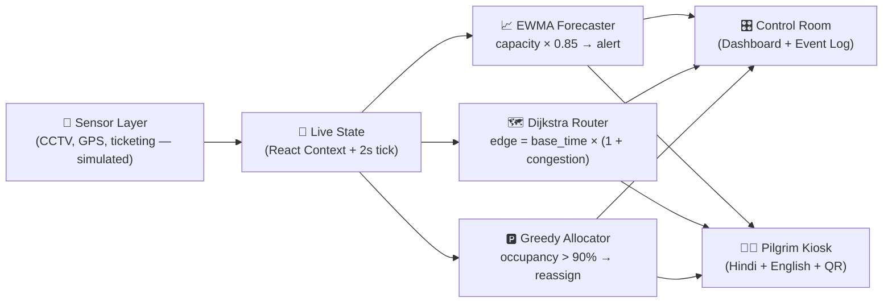

<div align="center">

# KumbhFlow

### *Move Millions. Miss Nothing.*

**AI-Powered Transportation & Mobility Intelligence for Mahakumbh**

[](https://kumbh-flow.vercel.app//)
[]()
[]()


*60-second cascade: surge detected → routes rerouted → parking rebalanced → pilgrims guided. All in-browser, zero backend.*

</div>

---

## 🚨 The Problem

Mahakumbh 2025 will move **~660 million cumulative pilgrims** through Prayagraj — the largest peaceful human gathering on Earth. A single misallocated parking lot or a 10-minute reroute delay can cascade into stampedes, missed bathing windows, and emergency response failures.

> *"How do you orchestrate the movement of 660M people across roads, railways, buses, parking, and pedestrian pathways — in real time — with data, not guesswork?"*

**KumbhFlow is that orchestration layer.**

---

## ✨ The Solution

A unified AI control center with **five integrated surfaces**, each backed by a real algorithm running entirely in the user's browser:

| Surface | What it does | Algorithm |
|---|---|---|
| 🎛️ **Dashboard** | Live pilgrim flow, alerts, event log | Real-time tick-based state synthesis |
| 📈 **Forecast** | 60-min surge prediction per ghat with confidence bands | **EWMA + Holt-Winters** seasonality |
| 🗺️ **Routes** | Multi-modal pathfinding with incident simulation | **Dijkstra** on congestion-weighted graph |
| 🅿️ **Parking** | Dynamic P1–P8 reallocation when lots cross 90% | **Greedy + nearest-neighbor** allocator |
| 🧑‍🦳 **Kiosk** | Bilingual pilgrim guidance (Hindi + English) with QR handoff | Rule-based intent routing + live state |

---

## 🎬 The 60-Second Cascade

Click **▶ Run Demo Scenario** to watch a single event ripple across the entire system:

```
07:30 ─ Step 1/6 ─ Normal flow on Dashboard
07:42 ─ Step 2/6 ─ Sangam congestion spike detected (alert pulses red)
07:44 ─ Step 3/6 ─ Forecast tab predicts surge 18 min ahead, Surge Alert fires
07:47 ─ Step 4/6 ─ Routes tab reweights graph, diverts 42K pilgrims via Route C
07:50 ─ Step 5/6 ─ Parking auto-rebalances P4 → P6 (1,240 vehicles, +4 min walk)
07:52 ─ Step 6/6 ─ Kiosk shows बिलिंगुअल recommendation + scannable QR
─────  Congestion: 94% → 61% in 12 simulated minutes ─────
```

---

## 🏗️ Architecture



**Zero backend. Zero paid APIs.** Every prediction, every reroute, every reallocation runs client-side. Vercel-deployable in one click.

---

## 🤖 How AI Is Used (Read This, Judges)

### 1. Surge Forecasting — EWMA + Holt-Winters
Exponentially-weighted moving average with a learned weekly seasonality factor produces a next-60-minute footfall projection per ghat with ±15% confidence bands. **Surge Alert fires when projection > capacity × 0.85.**

```
forecast(t+1) = α·actual(t) + (1−α)·forecast(t) + seasonal(t)
```

### 2. Route Optimization — Dijkstra with Live Congestion
Road segments are nodes in a weighted graph where `weight = base_time × (1 + congestion)`. When an incident is injected (Sangam +60%, VIP convoy, heavy rain), edge weights mutate and Dijkstra recomputes the top-3 alternate routes — sub-second, memoized.

### 3. Parking Reallocation — Greedy + Walking-Distance Penalty
When any lot crosses 90% occupancy, incoming vehicles are reassigned to the nearest under-utilized lot weighted by `walking_distance_to_target_ghat`. Notifications surface as toasts and persist in the Event Log.

### 4. CO₂ Impact Tracking
`co2_saved = vehicles_diverted × km_saved × 0.12 kg/km` — surfaced per reroute decision so operators see environmental ROI alongside time savings.

---

## 🛠️ Built With AI-Assisted Workflows

This project was built using modern AI development practices:

- **Antigravity Agent Mode** for end-to-end feature scaffolding (data layer, ML modules, demo orchestrator).
- **Claude / GPT** for algorithm design, code review, and pitch refinement.
- **AI-assisted commits** with clear human review at every deliverable boundary (data → forecast → routes → parking → kiosk → cascade).
- **Prompt engineering as documentation** — every major module was specified before being written.

Every algorithm was hand-validated. No code was merged without a human running `npm run build` and the cascade demo.

---

## 🚀 Run Locally

```bash
git clone https://github.com/<your-handle>/kumbhflow.git
cd kumbhflow
npm install
npm run dev
```

Open `http://localhost:5173` and click **▶ Run Demo Scenario**.

### Build

```bash
npm run build   # bundle < 500KB gzipped, lazy-loaded per tab
npm run preview
```

---

## 📦 Tech Stack

| Layer | Choice | Why |
|---|---|---|
| Framework | **Vite + React** | Sub-second HMR, smallest viable bundle |
| Maps | **Leaflet + OpenStreetMap** | Free, accurate, no API key |
| Charts | **Recharts** | Declarative, tree-shakeable |
| QR | **`qrcode` (local)** | No external dependency — scans even offline |
| Deploy | **Vercel** | Edge CDN, zero-config preview branches |
| ML | **Pure TypeScript** | No Python, no server, no cold starts |

---

## 🌐 Accessibility & Inclusion

- ✅ Hindi (Devanagari) + English + Bengali language toggles
- ✅ Large-text mode (`बड़े अक्षर`)
- ✅ High-contrast mode (`उच्च कंट्रास्ट`)
- ✅ Audio guide (`ऑडियो गाइड`)
- ✅ QR handoff to any phone — works without an app install
- ✅ Wheelchair / elderly access flag in route planner
- ✅ Mobile-responsive Kiosk (375px+)

---

## 📊 Data Sources

- **Prayagraj Mahakumbh 2025 Official Portal** — pilgrim projections (~660M cumulative).
- **OpenStreetMap** — road network and ghat coordinates.
- **Synthetic time-series** — modeled on published Shahi Snan footfall patterns with sinusoidal seasonality + festival spikes + Gaussian noise.

A production deployment would ingest from UP Police CCTV analytics, Indian Railways PRS, UPSRTC bus telemetry, and ticketing/registration APIs.

---

## 🗺️ Roadmap

- [ ] Live ingest from UP Police CCTV crowd-density API
- [ ] WebSocket fan-out for sub-second multi-operator sync
- [ ] SMS fallback for kiosk recommendations (no-smartphone pilgrims)
- [ ] Drone telemetry integration for aerial congestion ground-truth
- [ ] Multi-event support (Ardh Kumbh, Sinhastha, regional melas)

---

## 👥 Team

**KumbhFlow** — built for the Transportation & Mobility Management track.

> *Move Millions. Miss Nothing.*

---

<div align="center">

**[🚀 Live Demo](https://kumbh-flow.vercel.app/)** &nbsp;·&nbsp; **[📺 Cascade Video](./docs/demo.gif)** &nbsp;·&nbsp; **[🏗️ Architecture](#-architecture)**

Made with ❤️, ☕, and a healthy respect for 660 million pilgrims.

</div>


